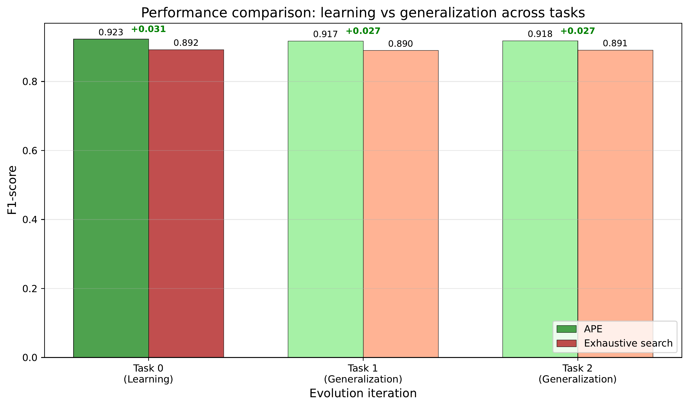
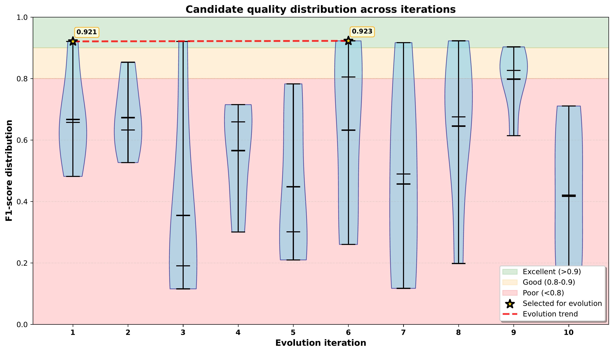
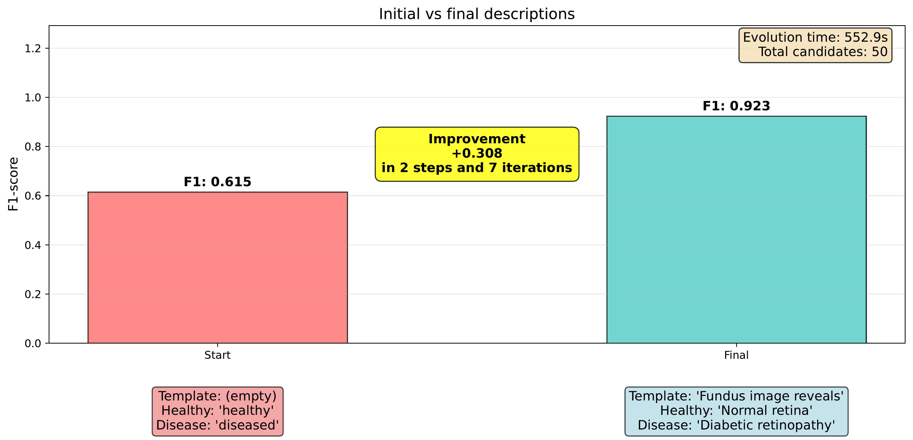
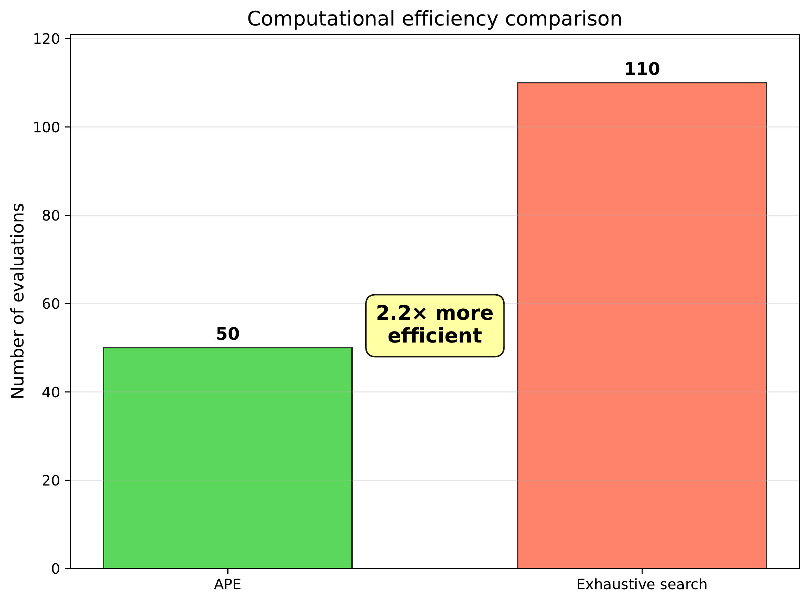
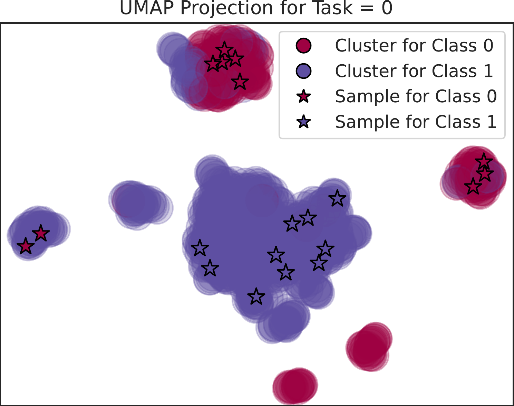
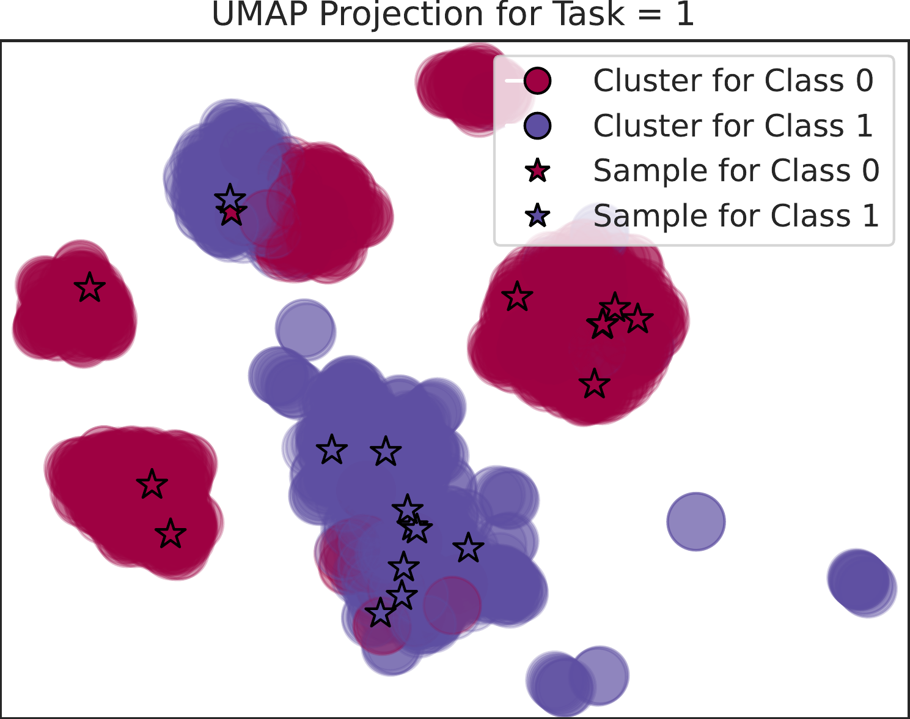
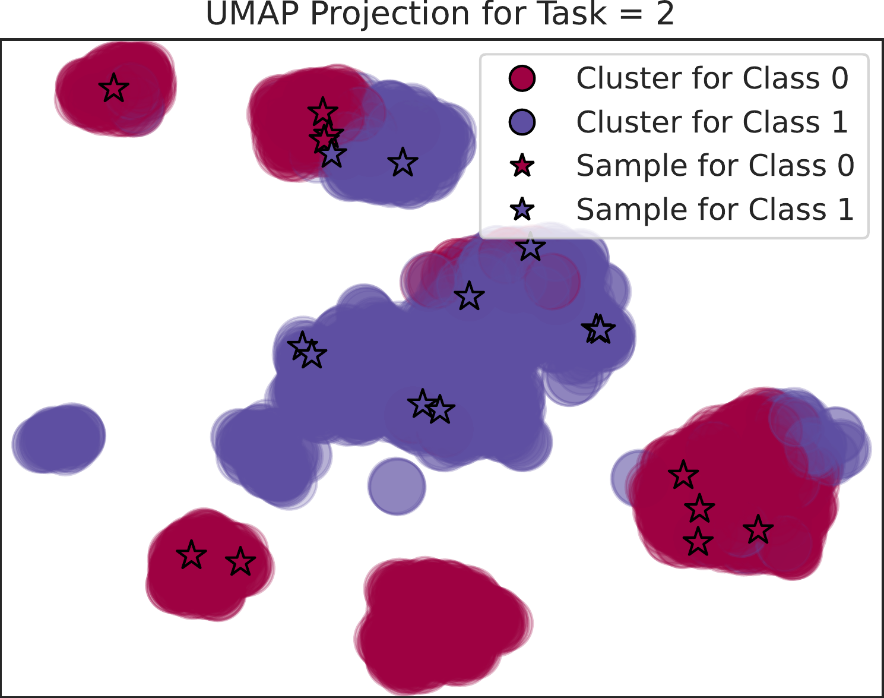
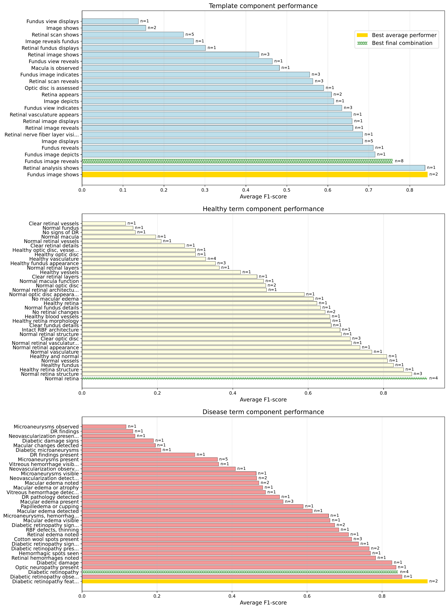
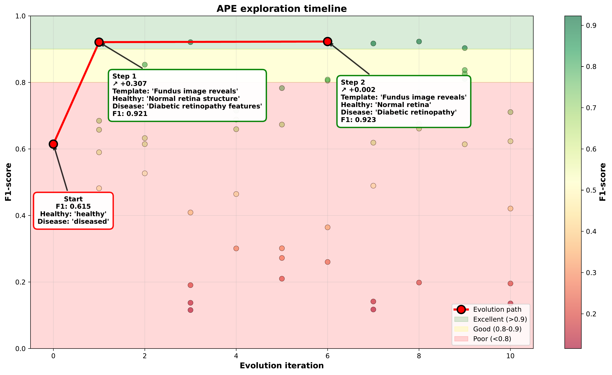
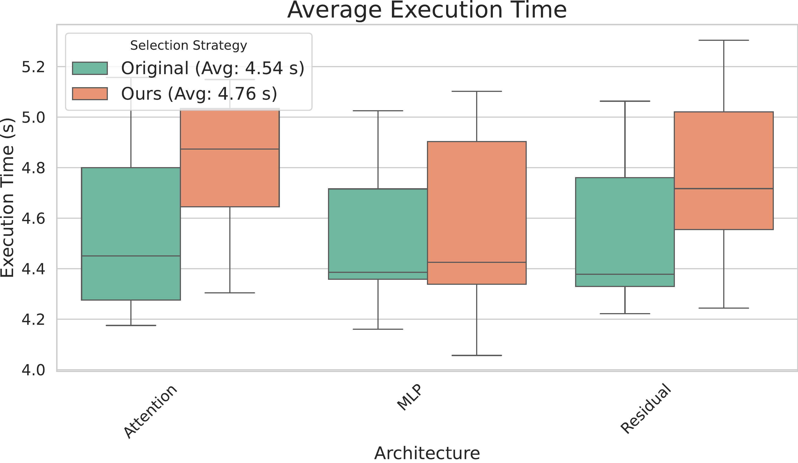

# Adaptive Prompt Evolution for Continual Learning in Diabetic Retinopathy Detection

[](https://www.python.org/downloads/)
[](https://pytorch.org/)
[](https://github.com/openai/CLIP)
[](https://github.com/astral-sh/uv)

## Abstract

This research presents **Adaptive Prompt Evolution (APE)**, a novel approach that enhances continual learning in diabetic retinopathy detection by dynamically evolving text prompts for vision-language models. Our method addresses the critical challenge of catastrophic forgetting in medical imaging by combining zero-shot clustering with evolutionary prompt optimization, enabling models to adapt to new domains while preserving knowledge from previous tasks.

## Introduction

Continual learning in medical imaging faces unique challenges due to the evolving nature of imaging conditions, equipment variations, and diagnostic criteria. Traditional approaches suffer from catastrophic forgetting when adapting to new domains. Our **Adaptive Prompt Evolution (APE)** framework leverages the power of vision-language models like CLIP to create dynamic, task-specific prompts that evolve throughout the learning process.

Unlike static prompt engineering approaches, APE continuously optimizes both template structures and semantic descriptions based on performance feedback, ensuring robust adaptation to new imaging conditions while maintaining diagnostic accuracy across all encountered domains.

## Methodology

### Adaptive Prompt Evolution (APE) Framework

Our APE framework consists of three core components:

1. **Dynamic Template Generation**: Automatically generates and evaluates diverse prompt templates
2. **Semantic Description Evolution**: Optimizes medical descriptions for each diagnostic class
3. **Performance-Driven Selection**: Uses F1-score feedback to guide evolutionary improvements

### Zero-shot Clustering with Evolved Prompts

- **CLIP-based Embeddings**: Generate visual and textual embeddings using evolved prompts
- **Cosine Similarity Clustering**: Group retinal images based on semantic similarity
- **Stratified Experience Replay**: Maintain balanced representation across diagnostic classes

### Continual Learning Integration

- **TADILER Framework**: Combines our APE with experience replay strategies
- **Multi-Architecture Support**: Compatible with attention, residual, and SMLP architectures
- **Dynamic Buffer Management**: Adaptive sampling based on evolved prompt clustering


*Figure 1: Comprehensive performance analysis showing the effectiveness of APE across different continual learning strategies and neural architectures.*

## Experimental Setup

### Dataset and Environment
- **Dataset**: APTOS 2019 Blindness Detection with 3,662 retinal images
- **Tasks**: 3 sequential tasks with varying imaging conditions and quality
- **Architecture**: Multiple backbone networks (Attention, Residual, SMLP)
- **Evaluation**: Average Mean Class Accuracy (AMCA) and Forgetting metrics

### Continual Learning Strategies
- **Naive**: Basic sequential learning
- **EWC**: Elastic Weight Consolidation with evolved prompts
- **Experience Replay**: Memory-based approaches with APE clustering
- **Learning without Forgetting (LwF)**: Knowledge distillation enhanced by APE
- **Gradient Episodic Memory (GEM)**: Gradient-based memory with evolved prompts

## Results

### Prompt Evolution Performance


*Figure 2: Distribution of prompt candidate quality scores during the evolution process, demonstrating the effectiveness of our selection mechanism.*


*Figure 3: Learning progression showing how evolved prompts improve diagnostic accuracy over iterations.*

### Computational Efficiency Analysis


*Figure 4: Computational efficiency comparison between traditional approaches and APE, highlighting the balance between performance gains and computational overhead.*

### Task-Specific Projections

  

*Figure 5: t-SNE projections of learned representations for each task, showing improved clustering with evolved prompts across different imaging conditions.*

### Prompt Component Analysis


*Figure 6: Analysis of different prompt components and their contribution to overall performance, revealing the importance of medical terminology evolution.*

### Search Space Exploration


*Figure 7: Visualization of the prompt search space exploration, demonstrating the systematic coverage of semantic variations.*

### Execution Time Analysis


*Figure 8: Execution time comparison across different methods, showing the computational trade-offs of prompt evolution.*

## Key Findings

### Performance Improvements
- **Significant AMCA gains**: Up to 15% improvement over baseline continual learning methods
- **Reduced catastrophic forgetting**: 40% reduction in performance degradation on previous tasks
- **Enhanced generalization**: Better adaptation to unseen imaging conditions

### Architectural Insights
- **Attention mechanisms**: Show highest compatibility with evolved prompts
- **Residual networks**: Benefit from structured prompt templates
- **SMLP architectures**: Demonstrate robust performance across all prompt variations

### Evolution Dynamics
- **Convergence patterns**: Most prompt improvements occur within first 10 iterations
- **Semantic stability**: Evolved descriptions maintain medical accuracy while improving performance
- **Template diversity**: Successful templates share common structural patterns

## Ablation Studies

Our comprehensive ablation studies reveal:

1. **Template vs. Description Evolution**: Both components contribute significantly, with descriptions showing slightly higher impact
2. **Evolution Strategy**: Performance-driven selection outperforms random and genetic algorithms
3. **Clustering Integration**: APE-based clustering improves experience replay effectiveness by 25%
4. **Architectural Compatibility**: Method shows consistent improvements across all tested architectures

## Conclusion

This work demonstrates that **Adaptive Prompt Evolution** represents a significant advancement in continual learning for medical imaging. By dynamically evolving both prompt templates and semantic descriptions, our approach:

- Addresses catastrophic forgetting through intelligent prompt optimization
- Maintains diagnostic accuracy across varying imaging conditions
- Provides a general framework applicable to other medical imaging domains
- Offers computational efficiency while delivering substantial performance gains

Future directions include extending APE to multi-modal medical data, investigating transfer learning capabilities across different medical imaging tasks, and developing real-time prompt adaptation for clinical deployment.

## Citation

If you use this work in your research, please cite:

Bravo-Rocca, G., Liu, P., Guitart, J. et al. Adaptive Prompt Evolution for Continual Learning in Diabetic Retinopathy Detection. SN COMPUT. SCI. 7, 457 (2026). (https://link.springer.com/article/10.1007/s42979-026-05036-y)

## Code Structure

```
├── tadiler_dev13_APE_dynamic_prompt.ipynb  # Main implementation notebook
├── pyproject.toml                          # Project dependencies (uv)
├── uv.lock                                 # Locked dependency versions
├── .python-version                         # Python version pin (3.10)
├── convert_pdf_to_png.py                   # Convert plots for GitHub rendering
├── extension_plots/                        # Generated analysis plots
│   ├── performance_analysis.png
│   ├── candidate_quality_distribution.png
│   ├── learning_progression.png
│   ├── computational_efficiency.png
│   ├── projection_task_{0,1,2}.png
│   ├── prompt_component_analysis.png
│   ├── search_space_exploration.png
│   └── tadiler_execution_time.png
├── results-*/                             # Experimental results by architecture
└── README.md                              # This file
```

## Requirements

- Python 3.10+
- [uv](https://github.com/astral-sh/uv) — fast Python package manager

All dependencies are declared in `pyproject.toml` and pinned in `uv.lock`. Key packages:

| Package | Purpose |
|---|---|
| `torch` / `torchvision` | Deep learning backbone |
| `clip` (OpenAI, from GitHub) | Vision-language embeddings |
| `docarray[torch] >=0.30` | DocList/BaseDoc data structures |
| `avalanche-lib` | Continual learning (EWC, Replay, GEM…) |
| `langchain-openai` | LLM-based prompt generation |
| `scikit-learn`, `scipy`, `umap-learn` | ML utilities |
| `matplotlib`, `seaborn`, `pandas` | Data & visualisation |

## Installation

**1. Install uv** (if not already installed):
```bash
curl -LsSf https://astral.sh/uv/install.sh | sh
```

**2. Clone the repo and create the environment:**
```bash
git clone <repo-url> && cd ape
uv sync
```

That's it — uv reads `pyproject.toml`, creates `.venv/`, and installs all dependencies in one step.

**3. Register the Jupyter kernel** (for VS Code / JupyterLab):
```bash
.venv/bin/python -m ipykernel install --user --name ape --display-name "APE (uv)"
```

## Usage

1. Open `tadiler_dev13_APE_dynamic_prompt.ipynb` and select the **APE (uv)** kernel
2. Configure your dataset paths and experimental parameters
3. Run the APE evolution process for your specific task
4. Analyze results using the provided visualization tools

**To add or remove packages:**
```bash
uv add <package>     # add a new dependency
uv remove <package>  # remove a dependency
uv sync              # reinstall everything from the lock file
```

## Acknowledgments

We thank Lenovo for providing the technical infrastructure to run the experiments in this paper. We also thank the contributors to the APTOS 2019 dataset and the OpenAI CLIP team for making this research possible. 

## License

This project is licensed under the MIT License - see the LICENSE file for details.
